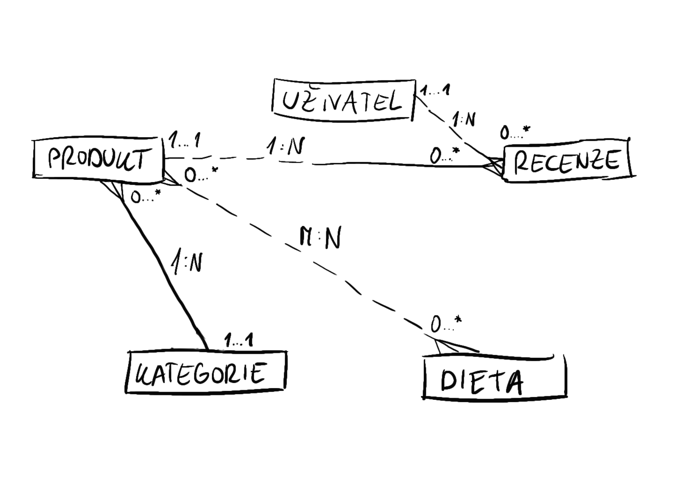

# Kavárna Penelope

*Autor: Jana Jelínková jana.jelinkova.s@gyarab.cz*

## Odborný článek 

Kavárna Penelope je webová aplikace přístupná na *odkaz*.

Slouží jako běžná webová aplikace kaváren, tedy má hlavně informativní funkce.

Homepage obsahuje přivítací slogan s pozadím fotografie kávy. Pod ním je element collapsible, na který když se klikne, tak znázorní otevírací doby kavárny. Na každé stránce je v zápatí místo určené pro základní informace o kavárně (název, e-mail, telefonní číslo). Hlavní menu obsahuje logo a odkaz na homepage, nabídku (jídla) a kontakty. 

Na stránce nabídka je vyhledávač konkrétních jídel či nápojů, vedle něj jsou možnosti filtrování dle diety a kategorie potravin. Pod tím je seznam nabídky dezertů, slaných pokrmů a nápojů, každému je přiřazený vlastní řádek, nalevo je název a napravo cena.

Stránka kontakty obsahuje kartu, na které je na obrázku vyznačená adresa kavárny na mapě, pod ní jsou napsané možné způsoby kontaktování (adresa, telefonní číslo a e-mail). Pod ní je druhá karta s názvem 'O nás', kde je obrázek kolektivu a krátký text o kavárně a zaměstnancích.

## Wireframes

## DB schéma
